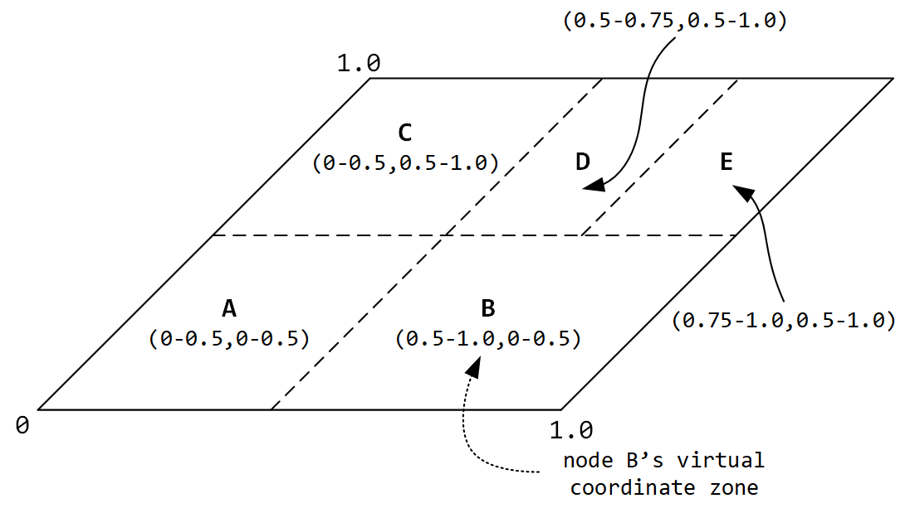
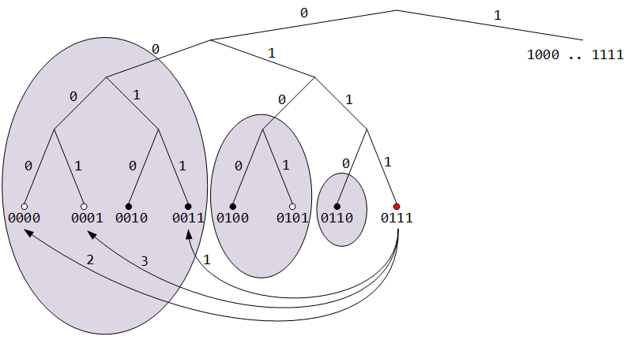

# Введение

## Актуальность работы

В связи с прогрессом в области информационных технологий наблюдается рост программного и аппаратного обеспечения, позволяющего решать многие задачи в различных сферах деятельности человека. Люди стали активно использовать платёжные системы, WEB-ресурсы для передачи данных, запоминающее устройства для записи и хранения важной информации и т.п. Всё это – заслуга компьютерных технологий. Однако в настоящее время активная интеграция современных информационных технологий практически во все области человеческой деятельности привела к тому, что с помощью программно-аппаратных средств и систем всё чаще совершаются разного рода правонарушения и преступления: нарушения в области авторского и смежных прав, хищения денежных средств, мошенничество, лжепредпринимательство, продажи секретной информации и т.п.

Преступления, совершаемые с использованием компьютерных технологий, представляют серьезную угрозу как для коммерческих организаций, так и для государственных структур. Такого рода преступления принято называть компьютерными преступлениями [1]. Наука, занимающаяся исследованием таких преступлений, называется компьютерной криминалистикой (на англ. computer forensics) [1]. Сам термин, форензика, произошёл от латинского «foren», что значит «речь перед форумом». В русский язык это слово пришло из английского. Полная форма этого термина на английском языке звучит следующим образом: «computer forensic science», что дословно означает «компьютерная криминалистическая наука». Согласно определению, компьютерная криминалистика – это прикладная наука о раскрытии преступлений, связанных с компьютерной информацией, об исследовании цифровых доказательств, методах поиска, получения и закрепления таких доказательств, о применяемых для этого технических средствах [1].

Данная область криминалистики полноценно существует в развитых странах: издан ряд научных трудов (Windows Forensic Analysis Toolkit, Harlan Carvey; The Art of Memory Forensics, Michael Hale Ligh, Andrew Case, Jamie Levy, AAron Walters и т. д.) имеются учебные курсы, существуют официальные рекомендации, которым необходимо следовать при криминалистической экспертизе.

В других странах компьютерная криминалистика лишь начинает развиваться. К сожалению, Россия относится как раз к таковым, не смотря на то, что в ней масса компьютерных специалистов высокого уровня. Например, одним из показателей является серийный выпуск программно-аппаратных комплексов, специализированных для сбора, обработки и анализа цифровых доказательств, для обеспечения целостности данных при изъятии и исследовании (например, PCI карта Tribble, проект WindowsSCOPE, LiMe и т. п.). В России такого рода обеспечение только начинает производиться, но всё чаще - закупается. Данное положение дел объясняется несколькими обстоятельствами: слаборазвитыми теоретическим и прикладным основаниями компьютерно-криминалистической науки, малым количеством доступных публикаций по данному направлению, а также не адаптированной к эффективному обучению основам криминалистической науки системой (высшего) образования.

Основными задачами компьютерной криминалистики являются извлечение и анализ информации, хранящейся в памяти компьютера. Но перед тем, как приступить к анализу извлеченных данных, их необходимо доставить в центр проведения компьютерно-технических экспертиз. К подобной передаче данных выдвигается масса требований: высокий уровень надежности, конфинденциальности и скорости, криминалистическая правильность [2], обеспечение целостности целевых данных.

Существует множество инструментов, решающих схожие задачи. На первый взгляд, их можно было бы использовать и в нашем случае. К сожалению, это не возможно из-за ряда ограничений, которые являются для нас принципиальными. В большинстве случаев, подобные решения основаны на  клиент-серверной архитектуре, которая не может обеспечить должный уровень отказоустойчивости и масштабируемости. Также среди ограничений можно отметить высокую стоимость, отсутствие открытого исходного кода под либеральными лицензиями и, как следствие, невозможность модификации программных компонентов под определённые задачи, платная техническая поддержка и т.п.

## Цель работы

Целью данной работы является создание распределенной системы криминалистического копирования и хранения данных в контексте задачи сбора цифровых доказательств.

## Задачи работы

Для достижения поставленной цели были сформулированы следующие задачи:
* исследование существующих распределенных система поиска, сбора и хранения данных;
* выбор сетевой архитектуры распределенного программного комплекса;
* разработка прикладного протокола передачи данных;
* апробация программного комплекса.

# Глава 1. Обзор распределенных систем поиска, сбора и хранения данных

## 1.1. Классификации сетей

Существуют два основных типа сетей [3]:

* клиент-серверный,
* одноранговый.

Использование одноранговой архитектуры более приоритетно ввиду большего уровня масштабируемости, автономности, анонимности и отказоустойчивости.

В некоторых случаях, рассматривают третий тип – гибридный, при котором в сеть добавляется координационный узел(лы) [4].

Одноранговая архитектура не подразумевает полное равенство узлов, в таких сетях могут находится супер-узлы, позволяющие управлять маршрутизацией и индексацией данных в сети. В связи с этим, принято классифицировать одноранговые сети по степени централизации [5]:

* централизованные (на англ. centralized P2P),
* полностью децентрализованные (на англ. pure P2P),
* гибридные (на англ. hybrid P2P).

Существует несколько способов организации связей между узлами в оверлейной сети, а также различные способы размещения и индексирования ресурсов. Поэтому, для сетей однорангового типа можно ввести ещё одну классификацию [5]:

* структурированные,
* неструктурированные.

В неструктурированных одноранговых системах нет определенной накладываемой на оверлейную сеть структуры, она формируется узлами, которые случайным образом соединяются друг с другом [6]. Поскольку все узлы в сети одинаковые и содержат относительно немного маршрутизационной информации, неструктурированная сеть устойчива к одновременному присоедниению или оттоку большого количества узлов [7].

Из недостатков неструктурированной сети можно отметить неэффективный поиск информации и большую нагрузку на сеть.

В структурированных одноранговых сетях оверлейная сеть имеет определённую топологию, которая гарантирует, что любой узел может эффективно (как правило, за O(logN) операций) осуществлять процедуру поиска даже очень редкого ресурса. Большинство структурированных одноранговых сетей организованы по принципу распределённой хэш таблицы (DHT). Для того, чтобы трафик в сети орагнизовывался эффективным образом, каждый узел должен поддерживать в актуальном состоянии список ближайших (по какой-либо метрике) улов – это делает структурированную сеть менее устойчивой к высокому притоку/оттоку участников.

Примеры классификации сетей:

1.  HTTP, FTP – клиент-серверная;
2.	Gnutella 0.4 – одноранговая, полностью децентрализованная, неструктурированная;
3.	Napster – одноранговая, централизованная, неструктурированная;
4.	Gnutella 0.6 – одноранговая, гибридная, неструктурированная;
5.	Chord, Kademlia, Pastry – одноранговая, полностью децентрализованная, структурированная.

Ввиду того, что в рамках рассматриваемой задачи маловероятен высокий приток/отток узлов за короткий промежуток времени, а также важна скорость выполнения запросов, низкий сетевой трафик, возможность масштабирования – было принято решение выбрать одноранговую, полностью децентрализованную, структурированную архитектуру сети.

## 1.2. Обзор класса распределенных систем типа «распределенная хэш таблица»

Большинство одноранговых структурированных систем представляет собой распределенную хэш таблицу (distributed hash table – DHT) [8]. Наиболее известные представители данного класса:

* Chord,
* Pastry,
* Tapestry,
* Kademlia.

У представленных систем много общего: все они используют 160-битные идентификаторы участников, схожие по семантике сообщения протоколов и т.п. [9][10][11]. Однако, последняя из этого списка – Kademlia была разработана с учетом недостатков, имеющихся у её предшественников, подробнее о которых написано в [12]. Стоит отметить, что Tapestry была разработана позднее, чем Kademlia, однако, существенных улучшений в ней не появилось, например, сложность поиска по-прежнему осталась логарифмической. Ещё одной причиной, на которой основан выбор Kademlia, является количество (популярность?) приложений, основанных на её протоколе (Tox, Kad Network, Ethereum, BitTorrent). По этой причине, остановимся на особенностях именно этой реализации DHT.

Kademlia имеет ряд достоинств, одним из которых является минимальное количество конфигурационных сообщений. Подобная информация распространяется автоматически, как побочный эффект ключевых операций системы.

Как было сказано выше, Kademlia использует базовый подход идентификации узлов – каждый участник системы имеет ID из 160-битного пространства ключей. Маршрутизация в системе устроена таким образом, что пары <ключ, значение> хранятся в таблицах узлов, чьи идентификаторы близки к рассматриваемому ключу по метрике основанной на операции «исключащего ИЛИ» (на англ. XOR). Использование данной функции возможно, поскольку пара (операция XOR, множество идентификаторов узлов) удовлетворяет аксимомам метрического пространства. Многие достоинства Kademlia основаны на примнении данной метрики. Например, благодаря её симметричности, сложность обратных запросов эквивалентна прямым запросам, что позволяет получить больше полезной информации из поисковых запросов, по сравнению с Chord. Также, использование данной метрики позволяет формально доказать тезисы о размерах таблиц маршрутизации и сложности поиска.

Таблица маршрутизации узла в Kademlia делится на части, количество которых, в общем случае, равно размерности пространства идентификаторов (как правило, 160). Каждая из частей ответственна за хранение информации об узлах на расстоянии от 2^i до 2^(i+1). Рассмотрим случай для узла с идентификатором 0111. Нулевая часть таблицы будет хранить информацию об узлах на расстоянии от 1 до 2 (в двоичном виде от 0001 до 0010), на таком расстоянии по метрике XOR может находиться всего лишь 1 узел: 0110. По аналогии, вторая часть таблицы будет содержать узлы на расстоянии от 0010 до 0100, т. е. узлы 0100 и 0101. Соответственно, третья часть – узлы 00хх. Если рассмотреть пространство узлов в виде двоичного дерева, то становится видно, что таблицы маршрутизации в Kademlia хранят информацию об узлах из каждого поддерева, несодержащего ветвь рассматриваемого узла (см. рис. 1.1.). Это следует из того факта, что в полностью заполненном бинарном дереве идентификаторов, расстоянием XOR между двумя идентификаторами является высота наименьшего поддерева, содержащего их обоих.

Рис. 1.1. Представление пространства идентификаторов в Kademlia DHT в виде бинарного дерева. Овалами выделены поддеревья, соответствующие частям таблицы маршрутизации узла 0111.

Протокол Kademlia гарантирует, что каждый узел знает по меньшей мере об одном из узлов в каждом поддереве. Благодаря этому, каждый узел может успешно выполнить процедуру поиска другого узла по его идентификатору. Схема на рис. 1.2 иллюстрирует процедуру поиска узла 0001, инициированную узлом 0111. Чёрным цветом выделены узлы, информация о которых имеется у рассматриваемого узла. Заметим, что рассматриваемая схема удовлетворяет описанным выше требованиям о знании хотя бы одного узла из каждого поддерева.

1. При помощи определения расстояния до узла 0001 происходит выбор части таблицы, ответственной за поддерево, в котором хранится искомый узел. Далее, поскольку рассматриваемый узел отсутствует в таблице маршрутизации, из текущей части таблицы выбирается ближайший к нему узел, которому отсылается поисковый запрос (0011).

2. В таблице маршрутизации узла 0011 не оказывается узла 0001, поэтому он осуществляет выбор части таблицы и возвращает ближайший узел 0000.

3. В таблице маршрутизациии узла 0000 есть узел 0001, который он и возвращает. Стоит отметить, что данного узла не может не быть в таблице, поскольку данное поддерево состоит из единственного узла.

Рис. 1.2. Процедура поиска узла 0001.

В Kademlia вводится ограничение на число хранимых узлов в каждой части таблицы маршрутизации – K. Поэтому каждую часть таблицы принято называть K-bucket. Данное число является параметром системы, конкретное оптимальное его значение – 20 было получено эмперическим путём. Таким образом, каждый узел имеет знания об от 1 до K узлов в каждом поддереве бинарного дерева.

Информация об узлах в K-bucket отсортирована по времени последнего контакта с узлом – в конце списка находятся узлы, контакт с которыми был раньше, чем с другими. Когда узел в Kademlia получает какое-либо сообщение (запрос или ответ) от другого узла, обновляется соответствующий узлу-отправителю K bucket. Далее происходит запись отправителя в конец списка, либо его перемещение, если узел-получатель уже знал об отправителе. В случае, если K-bucket полон, узел-получатель последовательно, начиная с первого в спике, пингует узлы до тех пор, пока не найдётся неответивший узел, который удаляется из списка, тем самым освобождая место для нового узла.

Одно из очевидных достоинств такой архитектуры таблиц маршрутизации – масштабируемость и отказоустойчивость. В случае, если произойдёт большой приток участников системы, тем самым вызвав подобие DDoS атаки – это не сбросит состояния таблиц маршрутизации, т.к. новые узлы будут добавлены только если старые станут неактивными. Другое достоинство, заключающееся в том, что узлы с большей вероятностью остаться в сети будут оставаться в таблицах маршрутизации, основано на экспериментальных данных и вытекает из того, что «старые» узлы хранятся в конце списка и будут опрошены с целью поиска места новому узлу последними.

Протокол Kademlia состоит из 4 удалённых вызовов процедур (на англ. remote procedure call – RPC): PING, STORE, FIND_NODE, FIND_VALUE. PING необходим для проверки состояния узла в сети. Запрос STORE позволяет разместить информацию на заданном узле. Для повышения доступности информации, STORE производится для K узлов, ближайших к идентификатору размещаемых данных. Запрос FIND_VALUE используется для поиска значения по ключу. Возвращает значение или K ближайших к интересующим данным узлов. Как правило, вызывается рекурсивно с двумя условиями выхода: получено значение или все полученные узлы уже опрошены. FIND_NODE отличается от FIND_VALUE тем, что всегда возвращает K узлов. Чаще всего используется при присоединении нового узла в систему.

Большинство вызовов в Kademlia совершаются асинхронно, а количество одновременно выполняемых запросов – alpha – является параметром системы и, как правило, равно трем.

# Глава 2. Модификация распределенной хэш таблицы Kademlia

Концепция архитектуры разрабатываемой системы основывается на распределнной хэш таблице Kademlia. Однако, поскольку некоторые особенности данной реализации не удовлетовряют нашим требованиям, необходимо модернизировать существующий протокол.

## 2.1. Идентификация узлов

В Kademlia близость узлов определяется операцией XOR над их идентификаторами, а значит не имеет никакого отношения к географической близости узлов. Поэтому было принято решение использовать композитную идентификацию узлов. При таком подходе, идентификатор узла представляет собой пару из 160-битного случайного идентификатора и IP-адреса. Первое значение пары используется в качестве аргумента введенной метрики при выполнении процедуры поиска, как и в других классических DHT-системах. Второе значение используется при передаче частей вновь появившихся в сети данных (будет описано в следующей главе). Следует признать, что метрика, построенная на IP-адресах, не всегда выражает связь с географической близостью и шириной пропускного канала между узлами, но в большинстве случаев эта связь присутствует и может быть использована.

Стоит заметить, что и IP-адрес и 160-битный идентификатор присутствует в таблице маршрутизации Kademlia, поэтому доработки были не значительными и заключались в изменении структуры данных – был введён дополнительный ключ поиска.

В дальнейшем возможно добавление других параметров, отражающих тесную связь со скоростью передачи данных между узлами.

## 2.2. «Горячая» передача данных

Для того, чтобы обеспечить возможность быстрой передачи данных напрямую из оперативной памяти агента, необходимо расширить протокол системы. Было введено новое сообщение, рекурсивно нотифицирующее участников сети о появлении новых данных. После получения данной нотификации, узел, которому предназначены эти данные (как правило, это центр компьютерно-технических экспертиз), инициирует процедуру поиска и выполняет копирование данных. (надо ли подробнее? в след. главе)

## 2.3.  Проверка целостности информации и аутентификация

Kademlia не покрывает вопросов аутентификации узлов и проверки целостности передаваемых данных. Существует множество работ, посвященных атакам на Kademlia-based сети [13][14]. Поэтому возникла необходимость в добавлении механизма обеспечения целостности сообщений и аутентификации источника данных.

В качестве такого механизма был выбран код аутентификации сообщений, использующий хеш-функции (сокращение от англ. hash-based message authentication code – HMAC) [15].

## 2.4. Тип транспортного протокола передачи данных

Классическая реализация Kademlia использует UDP в качестве транспортного сетевого протокола для всех сообщений. Поскольку разрабатываемая система должна обеспечивать высокую степень надежности передачи и доступности данных, было решено заменить транспортный протокол на TCP для ряда сообщений, среди которых, например, нотификация о получении доступа к новым данным.

# Глава 3. Архитектура и особенности программной реализации системы

## 3.1. Общие сведения

Как было сказано выше, работа системы осуществляется по принципу распределнной хэш-таблицы, за основу был взят протокол Kademlia.

Так как в системе используются разные транспортные протоколы, на каждом узле работает как UDP, так и TCP сервер, каждый из которых ответственен за обработку своих команд.

Для того, чтобы новый участник смог успешно присоединиться к системе, он должен знать по крайней мере один узел. Как правило, подобные узлы называются загрузочными (на англ. bootstrap)  и их адреса заранее известны [16].

## 3.2. Прикладной протокол передачи данных

Все сообщения протокола содержат идентификатор сообщения, 160-битный идентификатор узла-отправителя и код аутентификации сообщения.

Сообщения протокола:

* PING – проверка доступности заданного узла. Повторяет назначение в Kademlia.
* STORE – размещение информации о ресурсе, которая является парой 160-битного идентификатора и IP-адреса узла, на котором хранится ресурс, на заданном узле. Повторяет назначение в Kademlia.
* FIND_VALUE – поиск заданного значения по 160-битному ключу. Повторяет назначение в Kademlia.
* FIND_NODE – поиск K узлов, ближайших к заданному 160-битному ключу. Повторяет назначение в Kademlia
* NEW_DATA – сообщение, целью которого является оповещение участников сети о появлении новых данных в сети, требующих «доставки» в специальные узлы. В состав сообщения входят метаинформация о ресурсе, хэш значения фрагментов ресурса.

## 3.3. Сценарии работы системы

Присоединение нового участника:

* Регистрация в общем реестре. Выдача 160-битного идентификатора, закрытого ключа шифрования и массива открытых ключей шифрования участников.
* Отправка FIND_NODE сообщения со своим идентификатором загрузочному узлу(ам).
* Генерация своих k-buckets на основе ответа загрузочного узла.

Отправка данных в исследовательский центр:

* Отправка NEW_DATA сообщения, содержащего хэш суммы фрагментов (на англ. chunk) ресурса и метаинформацию.
* Отправка фрагментов ресурса участникам, ближайшим по метрике IP-адресов. Участники, получившие фрагмент выполняют вызовы STORE для K ближайших к хэшу фрагмента узлов.
* Заинтересованный в получении ресурса участник системы выполняет процедуру поиска по полученным хэш значениям.
* Получив список узлов, на которых хранятся фрагменты ресурса, узел скачивает не достающие фрагменты.
* После того, как участником получены все данные, генерируется 160-битный идентификатор как результат вычисления хэш функции от метаинформации о ресурсе и размещается на K узлах путём формирования сообщения STORE.

Получение ресурса в системе:

* Вычисление хэш значения от метаинформации о ресурсе.
* Выполнение процедуры поиска при помощи рекурсивных вызовов FIND_VALUE.
* В случае успешной процедуры поиска установка соединения с найденным узлом с целью загрузки ресурса.

# Заключение

## Результаты работы

В данной работе рассмотрены классификации одноранговых сетей. Исследованы главные представители систем типа распределенная хэш таблица. Представлен прикладной протокол передачи данных, позволяющий с высоким уровнем надежности, скорости и безопасности производить сбор цифровых доказательств и эффективный поиск по ним.

## Перспективы развития

В дальнейшем планируется провести апробацию представленного распределенного программного комплекса в реальных условиях.

Следующим шагом станет расширение области применения разработанной системы, унификация (?). Это позволит увеличить плотность оверлейной сети, в следствие чего увеличится эффективность поиска и доступность ресурсов.

# Список литературы

1.	Федотов Н.Н. Форензика – компьютерная криминалистика. Москва: «Юридический мир», 2007. 360 с.
2.	Иванищев В.О., Интроспекционный анализ динамики оперативной памяти операционных систем семейства Windows NT, 2015
3.	Peer-to-peer, https://en.wikipedia.org/wiki/Peer-to-peer
4.	Vasilios Darlagiannis, Hybrid Peer-to-Peer Systems, 2005
5.	Dr. Claudia Müller-Birn, Peer-to-peer systems, 2012
6.	A Survey of Structured P2P Systems for RDF Data Storage and Retrieval". Filali, Imen, 2011, p. 21
7.	Xing Jin, S.-H. Gary Chan, Unstructured Peer-to-Peer Network Architectures, 2010
8.	Rajiv Ranjan, Aaron Harwood, Rajkumar Buyya, Peer-to-Peer Based Resource Discovery in Global Grids: A Tutorial, 2007
9.	Ion Stoica, Robert Morris, David Karger, M. Frans Kaashoek, Hari Balakrishnan, Chord: A Scalable Peer-to-peer Lookup Service for Internet Applications, 2001
10.	 Antony Rowstron, Peter Druschel, Pastry: Scalable, decentralized object location and routing for large-scale peer-to-peer systems, 2001
11.	 Ben Y. Zhao, Ling Huang, Jeremy Stribling, Sean C. Rhea, Anthony D. Joseph and John D. Kubiatowicz, Tapestry: A Resilient Global-Scale Overlay for Service Deployment
12.	 Petar Maymounkov, David Mazieres, Kademlia: A peer-to-peer Information System Based on the XOR Metric, 2002
13.	 Jochen Dinger, Hannes Hartenstein, Defending the Sybil Attack in P2P Networks: Taxonomy, Challenges, and a Proposal for Self-Registration, 2006
14.	 Ingmar Baumgart, Sebastian Mies, S/Kademlia: A Practicable Approach Towards Secure Key-Based Routing, 2007
15.	 RFC 2104 - HMAC: Keyed-Hashing for Message Authentication, http:// http://www.faqs.org/rfcs/rfc2104.html
16.	 Nitesh Saxena, Gene Tsudik, Jeong Hyun Yi, Admission Control in Peer-to-Peer: Design and Performance Evaluation, 2000
