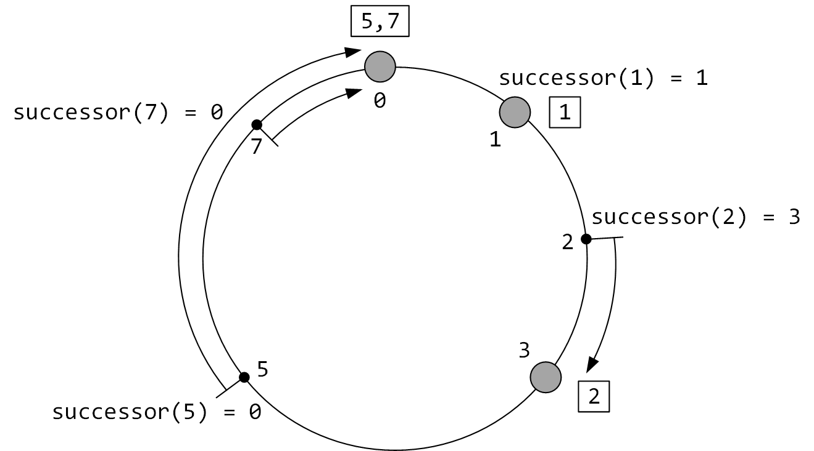

# Введение

## Актуальность работы

В связи с прогрессом в области информационных технологий наблюдается рост программного и аппаратного обеспечения, позволяющего решать многие задачи в различных сферах деятельности человека. Люди стали активно использовать платёжные системы, WEB-ресурсы для передачи данных, запоминающее устройства для записи и хранения важной информации и т.п. Всё это – заслуга компьютерных технологий. Однако в настоящее время активная интеграция современных информационных технологий практически во все области человеческой деятельности привела к тому, что с помощью программно-аппаратных средств и систем всё чаще совершаются разного рода правонарушения и преступления: нарушения в области авторского и смежных прав, хищения денежных средств, мошенничество, лжепредпринимательство, продажи секретной информации и т.п.

Преступления, совершаемые с использованием компьютерных технологий, представляют серьезную угрозу как для коммерческих организаций, так и для государственных структур. Такого рода преступления принято называть компьютерными преступлениями [1]. Наука, занимающаяся исследованием таких преступлений, называется компьютерной криминалистикой (на англ. computer forensics) [1]. Сам термин, форензика, произошёл от латинского «foren», что значит «речь перед форумом». В русский язык это слово пришло из английского. Полная форма этого термина на английском языке звучит следующим образом: «computer forensic science», что дословно означает «компьютерная криминалистическая наука». Согласно определению, компьютерная криминалистика – это прикладная наука о раскрытии преступлений, связанных с компьютерной информацией, об исследовании цифровых доказательств, методах поиска, получения и закрепления таких доказательств, о применяемых для этого технических средствах [1].

Данная область криминалистики полноценно существует в развитых странах: издан ряд научных трудов (Windows Forensic Analysis Toolkit, Harlan Carvey; The Art of Memory Forensics, Michael Hale Ligh, Andrew Case, Jamie Levy, AAron Walters и т. д.) имеются учебные курсы, существуют официальные рекомендации, которым необходимо следовать при криминалистической экспертизе.

В других странах компьютерная криминалистика лишь начинает развиваться. К сожалению, Россия относится как раз к таковым, не смотря на то, что в ней масса компьютерных специалистов высокого уровня. Например, одним из показателей является серийный выпуск программно-аппаратных комплексов, специализированных для сбора, обработки и анализа цифровых доказательств, для обеспечения целостности данных при изъятии и исследовании (например, PCI карта Tribble, проект WindowsSCOPE, LiMe и т. п.). В России такого рода обеспечение только начинает производиться, но всё чаще - закупается. Данное положение дел объясняется несколькими обстоятельствами: слаборазвитыми теоретическим и прикладным основаниями компьютерно-криминалистической науки, малым количеством доступных публикаций по данному направлению, а также не адаптированной к эффективному обучению основам криминалистической науки системой (высшего) образования.

Основными задачами компьютерной криминалистики являются извлечение и анализ информации, хранящейся в памяти компьютера. Но перед тем, как приступить к анализу извлеченных данных, их необходимо доставить в центр проведения компьютерно-технических экспертиз. К подобной передаче данных выдвигается масса требований: высокий уровень надежности, конфинденциальности и скорости, криминалистическая правильность [2], обеспечение целостности целевых данных.

Существует множество инструментов, решающих схожие задачи. На первый взгляд, их можно было бы использовать и в нашем случае. К сожалению, это не возможно из-за ряда ограничений, которые являются для нас принципиальными. В большинстве случаев, подобные решения основаны на  клиент-серверной архитектуре, которая не может обеспечить должный уровень отказоустойчивости и масштабируемости. Также среди ограничений можно отметить высокую стоимость, отсутствие открытого исходного кода под либеральными лицензиями и, как следствие, невозможность модификации программных компонентов под определённые задачи, платная техническая поддержка и т.п.

## Цель работы

Целью данной работы является создание распределенной системы криминалистического копирования и хранения данных в контексте задачи сбора цифровых доказательств.

## Задачи работы

Для достижения поставленной цели были сформулированы следующие задачи:
* исследование существующих распределенных система поиска, сбора и хранения данных;
* выбор сетевой архитектуры распределенного программного комплекса;
* разработка прикладного протокола передачи данных;
* апробация программного комплекса.

# Глава 1. Обзор распределенных систем поиска, сбора и хранения данных

## 1.1. Классификации сетей

Существуют два основных типа сетей [3]:

* клиент-серверный,
* одноранговый.

Использование одноранговой архитектуры более приоритетно ввиду большего уровня масштабируемости, автономности, анонимности и отказоустойчивости.

В некоторых случаях, рассматривают третий тип – гибридный, при котором в сеть добавляется координационный узел(лы) [4]. Но ввиду того, что данный тип мало распространен и не имеет явных достоинств перед остальными типами, опустим его рассмотрение.

Одноранговая архитектура не подразумевает полное равенство узлов, в таких сетях могут находится супер-узлы, позволяющие управлять маршрутизацией и индексацией данных в сети. В связи с этим, принято классифицировать одноранговые сети по степени централизации [5]:

* централизованные (на англ. centralized P2P),
* полностью децентрализованные (на англ. pure P2P),
* гибридные (на англ. hybrid P2P).

Существует несколько способов организации связей между узлами в оверлейной сети, а также различные способы размещения и индексирования ресурсов. Поэтому, для сетей однорангового типа можно ввести ещё одну классификацию [6]:

* структурированные,
* неструктурированные.

В неструктурированных одноранговых системах нет определенной накладываемой на оверлейную сеть структуры, она формируется узлами, которые случайным образом соединяются друг с другом [7]. Поскольку все узлы в сети одинаковые и содержат относительно немного маршрутизационной информации, неструктурированная сеть устойчива к одновременному присоедниению или оттоку большого количества узлов [8].

Из недостатков неструктурированной сети можно отметить неэффективный поиск информации и большую нагрузку на сеть.

В структурированных одноранговых сетях оверлейная сеть имеет определённую топологию, которая гарантирует, что любой узел может эффективно (как правило, за O(logN) операций) осуществлять процедуру поиска даже очень редкого ресурса. Большинство структурированных одноранговых сетей организованы по принципу распределённой хэш таблицы (DHT). Для того, чтобы трафик в сети орагнизовывался эффективным образом, каждый узел должен поддерживать в актуальном состоянии список ближайших (по какой-либо метрике) улов – это делает структурированную сеть менее устойчивой к высокому притоку/оттоку участников.

Примеры классификации сетей:

1.  HTTP, FTP – клиент-серверная;
2.	Gnutella 0.4 – одноранговая, полностью децентрализованная, неструктурированная;
3.	Napster – одноранговая, централизованная, неструктурированная;
4.	Gnutella 0.6 – одноранговая, гибридная, неструктурированная;
5.	Chord, Kademlia, Pastry – одноранговая, полностью децентрализованная, структурированная.

Ввиду того, что в рамках рассматриваемой задачи маловероятен высокий приток/отток узлов за короткий промежуток времени, а также важна скорость выполнения запросов, низкий сетевой трафик, возможность масштабирования – было принято решение выбрать одноранговую, полностью децентрализованную, структурированную архитектуру сети.

Большинство одноранговых структурированных систем представляет собой распределенную хэш таблицу (distributed hash table – DHT) [9]. Наиболее известные представители данного класса:

* Chord,
* Pastry,
* Kademlia.

У представленных систем много общего: в них используются 128 или 160 битные идентификаторы участников, схожие по семантике сообщения протоколов, а также все из них имеют логарифмическую вычислительную сложность процедуры поиска ресурса по идентификатору в среднем случае [10][11][12].

## 1.2. Chord DHT

Данная система была разработана в 2001 году в Массачусетском технологическом институте. В основе данной системы лежит технология консистентного хэширования. В качестве идентфикаторов узлов и данных выступают m бит результата хэш функции SHA-1 от IP-адреса и идентификатора данных соответственно. Число m является параметром системы и выбирается в зависимости количества участников системы таким образом, чтобы избежать коллизий. Идентификаторы в Chord образуют структуру кольца идентификаторов по модулю 2m (на англ. identifier circle modulo 2m). Ключ k назначается первому узлу, чей идентификатор равен или предшествует k в пространстве идентификаторов. Такой узел называется преемником (на англ. successor) ключа k и обозначется как successor(k). Поскольку идентификаторы упорядочены на кольце, преемником ключа k является первый узел встретившийся по часовой стрелке по пути от k (см. рис. 1.1.). По аналогии вводится понятие предшественника (на англ. predecessor) узла – predecessor(k).

Рис. 1.1. Кольцо идентификаторов по модулю 23 системы Chord.

В работе [10] показано, что в Chord выполнение процедуры поиска имеет логарифмическую сложность, таблицы маршрутизации имеют размер логарифмечески зависящий от количества узлов, а процедура обновления структур маршрутизации в случае удаления/добавления участника требует в среднем O(log2N) сообщений. Для того, чтобы добиться логарифмической сложности поиска, каждый узел хранит фингер-таблицу (на англ. finger table), содержающую до m записей, каждая из которых содержит информацию о преемнике successor((n + 2i-1) mod 2m), где i – номер записи (от 1 до m), n – идентификатор текущего узла, m – параметр системы. На схеме 1.2. проиллюстрирована фингер-таблица для узла с идентификатором 1.

Рис. 1.2. Фингер таблица узла 1.

Стоит отметить, что данная система также предназначена для выравнивания нагрузки на узлы. Но для поддержкки такого механизма требуется O(log2N) сообщений при каждом изменении состава оверлейной сети, что для наших задач является критичным, ввиду того, что  разрабатываемая система должна быть не требовательна к широкому пропускному каналу и стабильному соединению. Еще одна особенность, из-за которого использование Chord в данной работе не представляется возможным, касается степени близости узлов. К сожалению, введенное расстояние не является метрикой, поскольку не выполнена аксиома симметричности метрического пространства. Следствием ассиметричности близости узлов является увеличенное количество конфигурационных сообщений и отсутствие гарантий, что обратный запрос будет выполнен за то же количество сообщений, что и прямой.

## 1.3. Pastry DHT

Система Pastry была разработана в 2001 году сотрудниками университета Райса и Microsoft Researсh Ltd [11]. Организация пространства идентификаторов в одноранговой оверлейной сети Pastry напоминает реализацию Chord: каждому узлу присваивается случайный 128-битный идентификатор (nodeId), который используется для указания его позиции в кольцевом пространстве идентификаторов. Но, в отличие от Chord, ответственным за ресурс с ключом k является тот узел, чей идентифкатор является численно ближайшим к k (см рис. 1.3.).

Для маршрутизации nodeId и ключи рассматриваются как последовательность цифр с основанием 2b (где b – параметр системы и в классической реализации равен 4). В рамках процедуры поиска система Pastry направляет сообщения к узлу, чей идентификатор численно близок к рассматриваемому ключу. В большинстве случаев на каждом шаге маршрутизации получивший сообщение узел перенаправляет его узлу, у которого общий префикс с ключом больше, по крайней мере, на одну цифру, чем у текущего узла. В случае, если такого узла не оказалось в структуре маршрутизации, сообщение перенаправляется узлу, длина общего префикса которого аналогична текущему, но nodeId численно более близок к рассматриваемому ключу. Таким образом в большинстве случаев достигается порядок O(log2bN) количества сообщений при выполнении процедуры поиска. 

Рис. 1.3. Кольцо идентификаторов Chord.

Для обеспечения такой сложности поиска каждый участник системы поддерживает в актуальном состоянии структуру маршрутизации, которая состоит таблицы маршрутизации, множество окрестностей (на англ. neighborhood set) и множества листовых узлов (на англ. leaf set). 

Таблица маршрутизации содержит log2bN строк с 2b – 1 записями в каждой. Каждая запись в i-ой строке относится к узлу, длина общего с текущим узлом префикса nodeId которого равна i, в то время как i+1-ая цифра принимает одно из 2b – 1 значений, за исключением i+1-ой цифры nodeId текущего узла. 

Множество окрестностей M содержит информацию о ближайших узлах согласно внешней метрике близости, которая задаётся при конфигурации системы. Примером такой метрики может стать количество прыжков команды traceroute. Данная подструктура не используется в процессе маршрутизации, она необходима для инициализации и поддержке в актуальном состоянии других подструктур маршрутизации. Также она используется для проверки актуальности узлов (на англ. dead peer detection). Как правило, размер множества M равен 2 * 2b.

Множество листов содержит ближайшие узлы с точки зрения численной близости их nodeId, делится на ближайшие «слева» и «справа». Данное множество используется в конечном этапе маршрутизации. Размер множества листов совпадает с размером множества окрестностей.

На рис. 1.4. проиллюстрированы описанные подструктуры маршрутизации для nodeId = 10233102 и b = 2.

Рис. 1.4. Структура маршрутизации Pastry DHT.

Не смотря на то, что степень близости узлов, используемая на основном этапе маршрутизации, обладает свойством симметричности и позволяет добиться логарифмической сложности поиска, общая сложность процедуры поиска, строго говоря, не логарифмическая. Это объясняется тем, что метрика, применяемая в завершающем этапе маршрутизации, численная и в худшем случае способствует линейной сложности алгоритма поиска. Это усложняет формальное доказательство вычислительной сложности и анализ наихудшего поведения. 

Также стоит подчеркнуть сложность структуры маршрутизации, хранящейся на каждом узле системы. Необходимость поддержки второстепенной таблицы листов приводит к увеличению размера общей структуры до O(2blog2bN), времени инициализации новых узлов и усложнению протокола. В связи с этим не представляется возможным использование данной DHT при решении поставленных задач. Однако, возможность задать внешнюю метрику близости узлов очень важна в контексте задачи сбора цифровых доказательств. Поскольку множество окрестностей используется независимо от основого алгоритма маршрутизации, было принято решение использовать данный механизм.

## 1.5. Kademlia 

Kademlia разработана в 2002 году в Нью-Йоркском университете Петром Маймунковым и Давидом Мазьером. Kademlia имеет ряд достоинств, одним из которых является минимальное количество конфигурационных сообщений. Подобная информация распространяется автоматически, как побочный эффект ключевых операций системы [12].

В Kademlia используется базовый подход идентификации узлов – каждый участник системы имеет ID из 160-битного пространства ключей. Маршрутизация в системе устроена таким образом, что пары <ключ, значение> хранятся в таблицах узлов, чьи идентификаторы близки к рассматриваемому ключу по метрике основанной на операции «исключащего ИЛИ» (на англ. XOR). Использование данной функции возможно, поскольку пара (операция XOR, множество идентификаторов узлов) удовлетворяет аксимомам метрического пространства. Многие достоинства Kademlia основаны на примнении данной метрики. Например, благодаря её симметричности, сложность обратных запросов эквивалентна прямым запросам, что позволяет получить больше полезной информации из поисковых запросов, по сравнению с Chord. Также, использование данной метрики позволяет формально доказать тезисы о размерах таблиц маршрутизации и сложности поиска.

Таблица маршрутизации узла в Kademlia делится на части, количество которых, в общем случае, равно размерности пространства идентификаторов (как правило, 160). Каждая из частей ответственна за хранение информации об узлах на расстоянии от 2i до 2i+1. Рассмотрим случай для узла с идентификатором 0111. Нулевая часть таблицы будет хранить информацию об узлах на расстоянии от 1 до 2 (в двоичном виде от 0001 до 0010), на таком расстоянии по метрике XOR может находиться всего лишь 1 узел: 0110. По аналогии, вторая часть таблицы будет содержать узлы на расстоянии от 0010 до 0100, т. е. узлы 0100 и 0101. Соответственно, третья часть – узлы 00хх. 

Если рассмотреть пространство узлов в виде двоичного дерева, то становится видно, что таблицы маршрутизации в Kademlia хранят информацию об узлах из каждого поддерева, несодержащего ветвь рассматриваемого узла (см. рис. 1.5.). Это следует из того факта, что в полностью заполненном бинарном дереве идентификаторов, расстоянием XOR между двумя идентификаторами является высота наименьшего поддерева, содержащего их обоих. 

Рис. 1.5. Представление пространства идентификаторов в Kademlia DHT в виде бинарного дерева. Овалами выделены поддеревья, соответствующие частям таблицы маршрутизации узла 0111.

Протокол Kademlia гарантирует, что каждый узел знает по меньшей мере об одном из узлов в каждом поддереве. Благодаря этому, каждый узел может успешно выполнить процедуру поиска другого узла по его идентификатору. Схема на рис. 1.6 иллюстрирует процедуру поиска узла 0001, инициированную узлом 0111. Чёрным цветом выделены узлы, информация о которых имеется у рассматриваемого узла. Заметим, что рассматриваемая схема удовлетворяет описанным выше требованиям о знании хотя бы одного узла из каждого поддерева. 

Этапы процедуры поиска, продемонстрированной на рис. 1.6.:

1. При помощи определения расстояния до узла 0001 происходит выбор части таблицы, ответственной за поддерево, в котором хранится искомый узел. Далее, поскольку рассматриваемый узел отсутствует в таблице маршрутизации, из текущей части таблицы выбирается ближайший к нему узел, которому отсылается поисковый запрос (0011).
2. В таблице маршрутизации узла 0011 не оказывается узла 0001, поэтому он осуществляет выбор части таблицы и возвращает ближайший узел 0000.
3. В таблице маршрутизациии узла 0000 есть узел 0001, который он и возвращает. Стоит отметить, что данного узла не может не быть в таблице, поскольку данное поддерево состоит из единственного узла.

Рис. 1.6. Процедура поиска узла с идентификатором 0001 в Kademlia DHT.

В Kademlia вводится ограничение на число хранимых узлов в каждой части таблицы маршрутизации – k. Поэтому каждую часть таблицы принято называть k-bucket. Данное число является параметром системы, конкретное оптимальное его значение – 20 было получено эмперическим путём. Таким образом, каждый узел имеет знания об от 1 до k узлов в каждом поддереве бинарного дерева.

Информация об узлах в k-bucket отсортирована по времени последнего контакта с узлом – в конце списка находятся узлы, контакт с которыми был раньше, чем с другими. Когда узел в Kademlia получает какое-либо сообщение (запрос или ответ) от другого узла, обновляется соответствующий узлу-отправителю k bucket. Далее происходит запись отправителя в конец списка, либо его перемещение, если узел-получатель уже знал об отправителе. В случае, если k-bucket полон, узел-получатель последовательно, начиная с первого в спике, пингует узлы до тех пор, пока не найдётся неответивший узел, который удаляется из списка, тем самым освобождая место для нового узла.

Одни из очевидных достоинств такой архитектуры таблиц маршрутизации – масштабируемость и отказоустойчивость. В случае, если произойдёт большой приток участников системы, тем самым вызвав подобие DDoS атаки – это не сбросит состояния таблиц маршрутизации, т.к. новые узлы будут добавлены только если старые станут неактивными. Другое достоинство, заключающееся в том, что узлы с большей вероятностью остаться в сети будут оставаться в таблицах маршрутизации, основано на экспериментальных данных и вытекает из того, что «старые» узлы хранятся в конце списка и будут опрошены с целью поиска места новому узлу последними.

Протокол Kademlia состоит из 4 удалённых вызовов процедур (на англ. remote procedure call – RPC): PING, STORE, FIND_NODE, FIND_VALUE. PING необходим для проверки состояния узла в сети. Запрос STORE позволяет разместить информацию на заданном узле. Для повышения доступности информации, STORE производится для k узлов, ближайших к идентификатору размещаемых данных. Запрос FIND_VALUE используется для поиска значения по ключу. Возвращает значение или k ближайших к интересующим данным узлов. Как правило, вызывается рекурсивно с двумя условиями выхода: получено значение или все полученные узлы уже опрошены. FIND_NODE отличается от FIND_VALUE тем, что всегда возвращает k узлов. Чаще всего используется при присоединении нового узла в систему.

Большинство вызовов в Kademlia совершаются асинхронно, а количество одновременно выполняемых запросов – alpha – является параметром системы и, как правило, равно трем.

Также стоит отметить количество и популярность приложений, основанных на протоколе Kademlia – среди них Tox, Kad Network, Ethereum, BitTorrent. Учитывая данный факт и остальные перечисленные достоинства, было принято решение остановиться на этой реализации DHT.

# Глава 2. Архитектура распределенного программного комплекса

Концепция архитектуры разрабатываемой системы основывается на распределнной хэш таблице Kademlia. Однако, некоторые особенности данной реализации не удовлетовряют нашим требованиям, в связи с чем появилась необходимость модернизировать существующий протокол.

## 2.1. Идентификация узлов

В Kademlia близость узлов определяется операцией XOR над их идентификаторами, а значит не имеет никакого отношения к географической близости узлов. Поэтому было принято решение использовать композитную идентификацию узлов. При таком подходе, идентификатор узла представляет собой пару из 160-битного случайного идентификатора и IP-адреса. Первое значение пары используется в качестве аргумента введенной метрики при выполнении процедуры поиска, как и в других классических DHT-системах. Второе значение играет важную роль при передаче ответственности за данные, а также уменьшение сетевых задержек при проверке актуальности состояния узлов. Следует признать, что метрика, использующая IP-адреса, не всегда выражает связь с географической близостью и шириной пропускного канала между узлами, но в большинстве случаев эта зависимость присутствует и может быть использована.

Стоит заметить, что и IP-адрес и 160-битный идентификатор присутствует в таблице маршрутизации Kademlia, поэтому доработка заключалась в изменении структуры данных – был введён дополнительный индекс. В дальнейшем возможно добавление других параметров, отражающих тесную связь с временем задержки обмена сообщениями и скоростью передачи данных между узлами.

Еще один способ поддержки локальности отправляемых запросов, с целью уменьшения задержек и увеличения быстродействия системы, – это использование дополнительной структуры маршрутизации, подобно множеству окрестностей в Pastry. Данное множество содержит список ближайших по внешней метрике узлов для отправки им сообщений, описанных выше.

Выбор способа поддержки внешней метрики является параметром системы, эффективность того или иного способа зависит от количества участников системы, плотности их размещения и т.п.

## 2.2. «Горячая» передача данных

Для того, чтобы обеспечить возможность быстрой передачи данных напрямую из оперативной памяти агента, необходимо расширить протокол системы. Было введено новое сообщение, нотифицирующее определенный набор участников сети о появлении новых данных. После получения данной нотификации, узел, которому предназначены эти данные – как правило, это центр компьютерно-технических экспертиз, – инициирует процедуру поиска и выполняет копирование данных.

В случае, если отстутствует прямое стабильное соединение между агентом, получившего доступ к данным, и центром, первый последовательно распространяет фрагменты данных среди участников, близких по внешней метрике. Узлы, получившие фрагменты данных, нотифицируют участников, которым эти данные предназначены.

## 2.3.  Проверка целостности информации и аутентификация

Kademlia не покрывает вопросов аутентификации узлов и проверки целостности передаваемых данных. Существует множество работ, посвященных атакам на Kademlia-based сети [13][14][15]. Поэтому возникла необходимость в добавлении механизма обеспечения целостности сообщений и аутентификации источника данных.

В качестве такого механизма был выбран код аутентификации сообщений, использующий хеш-функции – HMAC (сокращение от англ. hash-based message authentication code) [16].

Стоит отметить, что подобное дополнение может ухудшить быстродействие системы и увеличить процесс инициализаци новых участников, поэтому данный механизм используется только при передаче данных от агентов в центральный узел.

## 2.4. Тип транспортного протокола передачи данных

Классическая реализация Kademlia использует UDP в качестве транспортного сетевого протокола для всех сообщений. Поскольку разрабатываемая система должна обеспечивать высокую степень надежности передачи и доступности данных, было решено заменить транспортный протокол на TCP для ряда сообщений, среди которых, например, нотификация о получении доступа к новым данным.

Так как в системе используются два транспортных протокола, на каждом узле работает как UDP, так и TCP сервер, каждый из которых ответственен за обработку своих команд. Это незначительно усложняет программную реализацию.

## 2.5. Прикладной протокол передачи данных

Все сообщения протокола содержат идентификатор сообщения, 160-битный идентификатор узла-отправителя и код аутентификации сообщения. Сообщения, требующие ответа, дополнительно содержат случайное значение из пространства идентификаторов (на англ. magic coockie), которое ожидается в ответном сообщении.

Сообщения протокола:

* PING – проверка доступности заданного узла. Повторяет назначение в Kademlia.
* STORE – размещение информации о ресурсе, которая является парой 160-битного идентификатора и IP-адреса узла, на котором хранится ресурс, на заданном узле. Повторяет назначение в Kademlia.
* FIND_VALUE – поиск заданного значения по 160-битному ключу. Повторяет назначение в Kademlia.
* FIND_NODE – поиск K узлов, ближайших к заданному 160-битному ключу. Повторяет назначение в Kademlia
* NEW_DATA – сообщение, целью которого является оповещение специального набора участников сети о появлении новых данных, требующих отправки. В состав сообщения входит метаинформация о источнике данных, список хэш-сумм содержимого фрагментов данных, HMAC.

## 2.6. Сценарии работы системы

Для того, чтобы новый участник смог успешно присоединиться к системе, он должен знать по крайней мере IP-адрес одного узла, находящегося в системе. Как правило, подобные узлы называются загрузочными (на англ. bootstrap)  и их адреса заранее известны [17].

Присоединение нового участника:

* Регистрация в общем реестре. Выдача 160-битного идентификатора, закрытого и открытого ключей шифрования, используемых в механизме HMAC.
* Отправка FIND_NODE сообщения со своим идентификатором загрузочным узлам.
* Рекурсивная отправка FIND_NODE сообщения узлам, полученным в результате предыдущего запроса. Опрос завершается, если новые узлы не появляются либо достигнуто максимальное количество узлов n (параметр системы). 
* Генерация своих k-buckets и множества окрестностей на основе полученного множества узлов.

Отправка данных в исследовательский центр при наличии стабильного соединения между агентом, получившим доступ к данным, и исследовательским центром (см. 2.1.):

* Отправка STORE сообщения k ближайшим по XOR метрике узлам для всех всех фрагментов ресурса.
* Отправка NEW_DATA сообщения, содержащего хэш суммы фрагментов (на англ. chunk) ресурса и метаинформацию.
* Заинтересованный в получении данных участник системы выполняет процедуру поиска по полученным хэш значениям.
* Получив список узлов, на которых хранятся фрагменты ресурса, узел последовательно скачивает необходимые фрагменты.
* После того, как участником получены все данные, идентификаторы полученных фрагментов размещаются на k ближайших узлах путём формирования сообщения STORE. 

Рис. 2.1. Отправка данных в исследовательский центр. Размещение пар <ключ, значение> в k-buckets ближайших по XOR метрике узлах (красные связи). Нотификация центральных узлов о появлении новых данных (синие связи). Процедура поиска появившихся данных (зеленые связи). Загрузка новых данных (чёрная связь).

Отправка данных в исследовательский центр при отсутствии прямого соединения между агентом и центром (см. 2.2.):

* Последовательная передача фрагментов данных ближайшему участнику сети, имеющему стабильному связь с центром. На данном этапе используется внешняя метрика, основанная на IP-адресах.
* Отправка сообщений STORE и NEW_DATA узлом, получившим фрагмент данных.
* Последующие этапы аналогичны предыдущему сценарию.

Рис. 2.2. Отправка данных в исследовтельский центр C3 через посредника.

Получение ресурса в системе:

* Получение хэш значения в процессе нотификаций от агентов.
* Выполнение процедуры поиска при помощи рекурсивных вызовов FIND_VALUE.
* В случае успешной процедуры поиска установка соединения с найденным узлом с целью загрузки ресурса.

Таким образом, разработанная система удовлетворяет требованиям высокой доступности данных, обеспечивает проверку целостности передаваемых данных, не подвержена DoS-атакам, имеет возможность поиска с логарифмической вычислительной сложностью от количества узлов в системе. Одной из уязвимостей данной системы является множество загрузочных узлов, как и в любой другой одноранговой системе, поэтому по сравнению с центральными узлами и агентами к ним выдвигаются более строгие требования к времени непрерывной работы. Другим недостатком можно назвать высокую сложность и большое количество параметров системы. Это является следствием запланированной унификации системы и интеграции в качестве бек-енда в другие информационные системы.

# Заключение

## Результаты работы

В данной работе рассмотрены классификации одноранговых сетей. Исследованы главные представители систем типа распределенная хэш таблица. Представлен прикладной протокол передачи данных, позволяющий с высоким уровнем надежности, скорости и безопасности производить сбор цифровых доказательств и эффективный поиск по ним.

В дальнейшем планируется провести апробацию представленного распределенного программного комплекса в реальных условиях.

Следующим шагом станет расширение области применения разработанной системы. Это позволит увеличить плотность оверлейной сети, в следствие чего увеличится эффективность поиска и доступность ресурсов.

# Список литературы

1.	Федотов Н.Н. Форензика – компьютерная криминалистика. Москва: «Юридический мир», 2007. 360 с.
2.	Иванищев В.О. Интроспекционный анализ динамики оперативной памяти операционных систем семейства Windows NT, 2015
3.	Peer-to-peer, https://en.wikipedia.org/wiki/Peer-to-peer
4.	Darlagiannis V. Hybrid Peer-to-Peer Systems // Peer-to-Peer Systems and Applications. Springer, 2005. p. 353
5.	Schollmeier R. A definition of peer-to-peer networking for the classification of peer-to-peer architectures and applications // First International Conference on Peer-to-Peer Computing, 2001
6.	Filali I., Huet F. Dynamic TTL-Based Search in Unstructured Peer-to-Peer Networks // 2010 10th IEEE/ACM International Conference on Cluster, Cloud and Grid Computing, 2010
7.	Filali I. A Survey of Structured P2P Systems for RDF Data Storage and Retrieval, Springer, 2011, p. 21
8.	Guirat F.B., Filali I. An efficient data replication approach for structured peer-to-peer systems // International Conference Telecommunications (ICT), 2013
9.	Ranjan R., Harwood A., Buyya R. Peer-to-peer-based resource discovery in global grids: a tutorial // IEEE Communications Surveys & Tutorials, Volume 10, Issue 2, 2008
10.	Stoica I., Morris R., Karger D., Kaashoek M. F., Balakrishnan H. Chord: A Scalable Peer-to-peer Lookup Service for Internet Applications // ACM SIGCOMM Computer Communication Review, Volume 31, Issue 4, 2001
11.	Rowstron A., Druschel P. Pastry: Scalable, decentralized object location and routing for large-scale peer-to-peer systems // IFIP/ACM International Conference on Distributed Systems Platforms, 2001, pp. 329-350
12.	Maymounkov P., Mazieres D. Kademlia: A peer-to-peer Information System Based on the XOR Metric, 2002
13.	Lee Y., Koo H., Choi S. Advanced node insertion attack with availability falsification in Kademlia-based P2P networks // 14th International Conference on Advanced Communication Technology (ICACT), 2012
14.	Lee Y., Kim K., Roh B. H. DDoS Attack by File Request Redirection in Kad P2P Network // International Conference on Cyber-Enabled Distributed Computing and Knowledge Discovery, 2012
15.	Baumgart I., Mies S. S/Kademlia: A practicable approach towards secure key-based routing // International Conference on Parallel and Distributed Systems, 2007
16.	RFC 2104 - HMAC: Keyed-Hashing for Message Authentication, http:// http://www.faqs.org/rfcs/rfc2104.html
17.	 Saxena N., Tsudik G., Yi J. H., Admission Control in Peer-to-Peer: Design and Performance Evaluation // Proceedings of 1st ACM workshop on Security of ad hoc and sensor networks, 2003

